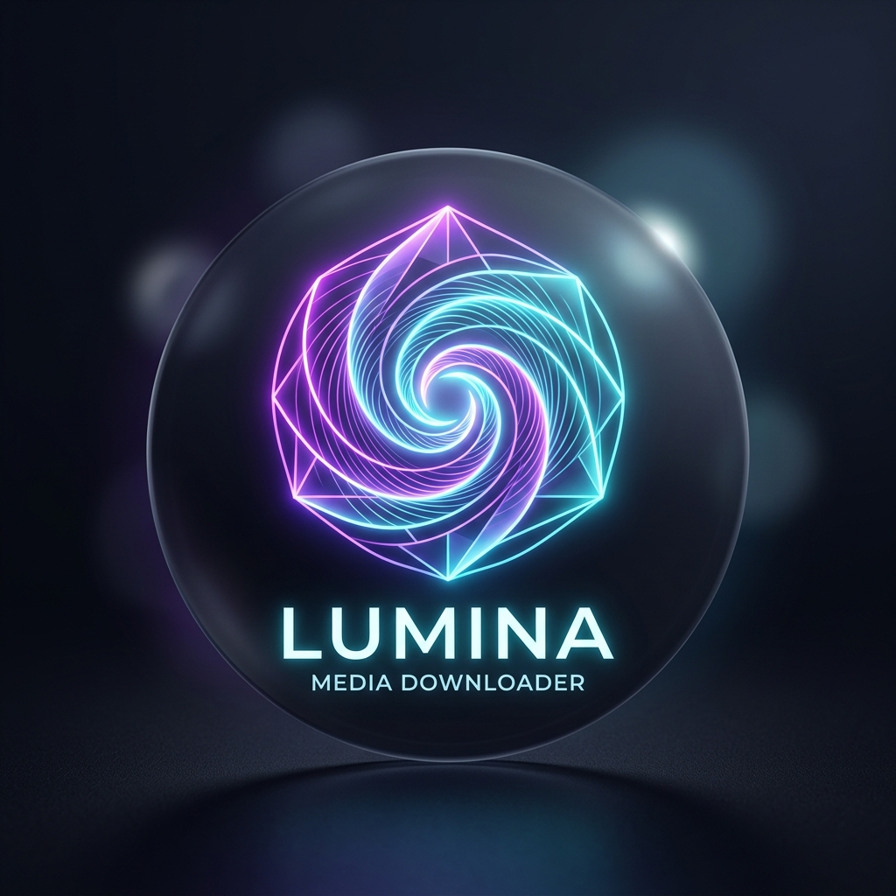
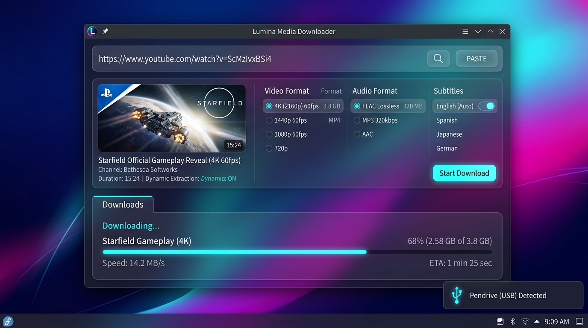

# Lumina Media Workstation

> **Ultra-Sleek, Hardware-Accelerated Universal Media Harvester & Player**  
> Built for **Fedora 44 (Linux)** with seamless cross-platform targeting for **Windows 11/10** and **macOS**.

---

## Visual Branding & Interface Architecture

| Brand Icon & Logo Concept | Desktop UI & Downloader Interface |
| :---: | :---: |
|  |  |

---

## Architectural Blueprints & Planning Specifications

Every dimension of this software has been meticulously architected, defensively engineered, and validated through triple verification prior to implementation:

1. [**01. Brand Identity & Visual Design Specification**](docs/01_BRANDING_AND_IDENTITY.md)  
   Name evaluation, brand positioning, SVG vector logo geometry, color design tokens, and splash screen boot choreography.

2. [**02. UI/UX & Motion Design Specification**](docs/02_UI_UX_AND_MOTION_DESIGN_SYSTEM.md)  
   Cyber-minimalist glassmorphism, dynamic WebGL ambient background, magnetic spring buttons, smart omnibox with clipboard auto-detect, and layout wireframes.

3. [**03. Tech Stack & System Architecture Specification**](docs/03_TECH_STACK_AND_SYSTEM_ARCHITECTURE.md)  
   Deep evaluation of Electron vs Tauri vs Flutter vs Python, multi-process IPC model, type-safe Preload bridge, and cross-platform packaging strategy.

4. [**04. Core Downloader & Format Engine Specification**](docs/04_CORE_DOWNLOADER_AND_FORMAT_ENGINE.md)  
   Multi-platform ingestion (YouTube, Instagram, etc.), unthrottled 8K/4K dual-stream retrieval, FFmpeg lossless muxing, and granular subtitle engine.

5. [**05. Storage Routing & USB Hardware Detection Specification**](docs/05_STORAGE_ROUTING_AND_USB_DETECTION.md)  
   Removable drive monitoring (`lsblk -J` on Linux, Win32 on Windows), automatic directory creation (`/LuminaMedia/Videos` and `/Music`), and NVMe SSD staging buffer pattern.

6. [**06. Music Discovery & In-App Player Specification**](docs/06_MUSIC_DISCOVERY_AND_PLAYER_SYSTEM.md)  
   Multi-source music search, Web Audio 64-band frequency spectrum visualizer, FLAC/MP3 320k one-click download, and ID3v2/Vorbis metadata tagging.

7. [**07. Settings, Network & Anti-Bot Shield Specification**](docs/07_SETTINGS_NETWORK_AND_ANTI_BOT_SHIELD.md)  
   5-panel settings hierarchy, 1-click browser cookie vault, multi-client evasion, rate-limit avoidance, and self-updating engine.

8. [**08. Bug Prevention, Edge Cases & Stability Engineering**](docs/08_BUG_PREVENTION_EDGE_CASES_AND_STABILITY.md)  
   Failure mode catalog, pre-flight disk space checking, cross-platform filename sanitization, child process cleanup, and Wayland display optimization.

9. [**09. Double & Triple Verification Matrix**](docs/09_DOUBLE_AND_TRIPLE_VERIFICATION_MATRIX.md)  
   Three-tiered audit: Requirements Alignment (Tier 1), Environment & Feasibility (Tier 2), Edge-Case Stress & Packaging (Tier 3).

10. [**10. Systematic Execution Roadmap**](docs/10_SYSTEMATIC_EXECUTION_ROADMAP.md)  
    Phased implementation plan from scaffolding to final packaging.
