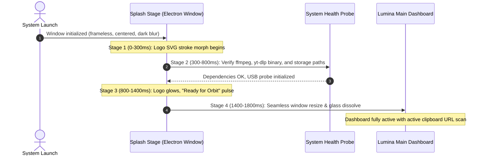

# Lumina Media Workstation — Brand Identity & Visual Design Specification

## 1. Executive Summary & Vision
**Lumina Media Workstation** is an uncompromising, hardware-accelerated universal desktop media harvester and player designed for modern workstations. Built initially for **Fedora 44 (Linux)** with seamless cross-platform targeting for **Windows 11/10** and **macOS**, Lumina bridges the gap between raw CLI power (`yt-dlp` and `ffmpeg`) and an ultra-modern, glassmorphic GUI with fluid 120fps motion design.

---

## 2. Name Evaluation & Suggestions

We evaluated six distinct naming candidates based on brand recall, phonetic crispness, domain versatility, and store-listing uniqueness:

| Name Candidate | Phonetic Feel | Brand Association | Recommendation Score | Rationale |
| :--- | :--- | :--- | :--- | :--- |
| **Lumina** / **Lumina Media** | Smooth, radiant, modern | Illumination, crystal-clear streams, premium clarity | **10/10 (Top Choice)** | Perfectly matches the glowing glassmorphic UI, highly memorable, friendly for both Linux Flathub/RPM and Windows Store. |
| **Vortex Engine** | Sharp, energetic | Gravitational pull of all streams, high-speed ingestion | **9/10** | Strong and powerful, though slightly more aggressive/gamer-oriented. |
| **PulseStream** | Rhythmic, musical | Dynamic video/audio duality, live status pulses | **8.5/10** | Great for music discovery, slightly generic for video archiving. |
| **Aetheria** | Elegant, sci-fi | Lightness, weightless performance, dark nebula vibes | **8.5/10** | Very distinctive, slightly abstract. |
| **OmniHarvest** | Industrial, thorough | Universal ingestion across 1000+ platforms | **8/10** | Very clear utility, but sounds less consumer-luxe. |
| **Velox Media** | Swift, clinical | Speed, minimal Latin-rooted precision | **8/10** | Clean, fast, but less evocative than Lumina. |

> **Selected Brand Name**: **Lumina Media** (or **Lumina Workstation**).

---

## 3. Brand Pillars & Design Philosophy

1. **Uncompromised Fidelity**: Never compress or downgrade streams arbitrarily. If a video is available in 8K 60fps AV1 with 5.1 surround sound or an audio track in lossless FLAC/OPUS, Lumina delivers the exact bitstream.
2. **Tactile Digital Glass**: Interfaces should not feel like flat web pages or clunky native forms. Lumina uses depth, subtle layered dark glass, frosted backdrops, and hardware-accelerated ambient luminescence.
3. **Frictionless Zero-Config Automation**: From automatic clipboard link ingestion to intelligent USB pendrive detection and auto-saving, the tool operates with zero cognitive load.

---

## 4. Logo Concept & Vector Specifications

### Concept Description
The Lumina logo represents a **refracting prism waveform** enclosed within a dark orb of glass. The central motif is a mathematical spiral vortex combined with a hexagonal prism, glowing with dual-frequency cyan (`#00F2FE`) and violet (`#9D4EDD`) gradients.

- **Primary SVG Definition**:
```xml
<svg xmlns="http://www.w3.org/2000/svg" viewBox="0 0 512 512" fill="none">
  <defs>
    <!-- Background Radial Glow -->
    <radialGradient id="luminaSphere" cx="50%" cy="50%" r="50%">
      <stop offset="0%" stop-color="#181928" stop-opacity="0.95"/>
      <stop offset="70%" stop-color="#0E0F17" stop-opacity="0.98"/>
      <stop offset="100%" stop-color="#06060A" stop-opacity="1"/>
    </radialGradient>
    
    <!-- Neon Core Gradient -->
    <linearGradient id="luminaGradient" x1="0%" y1="0%" x2="100%" y2="100%">
      <stop offset="0%" stop-color="#9D4EDD"/>
      <stop offset="50%" stop-color="#7928CA"/>
      <stop offset="75%" stop-color="#00D4FF"/>
      <stop offset="100%" stop-color="#00F2FE"/>
    </linearGradient>

    <!-- Glass Rim Gradient -->
    <linearGradient id="glassRim" x1="0%" y1="0%" x2="0%" y2="100%">
      <stop offset="0%" stop-color="#FFFFFF" stop-opacity="0.4"/>
      <stop offset="40%" stop-color="#FFFFFF" stop-opacity="0.05"/>
      <stop offset="100%" stop-color="#00F2FE" stop-opacity="0.2"/>
    </linearGradient>

    <!-- Glow Filter -->
    <filter id="neonGlow" x="-20%" y="-20%" width="140%" height="140%">
      <feGaussianBlur stdDeviation="12" result="blur" />
      <feMerge>
        <feMergeNode in="blur" />
        <feMergeNode in="SourceGraphic" />
      </feMerge>
    </filter>
  </defs>

  <!-- Outer Glass Shell -->
  <circle cx="256" cy="256" r="230" fill="url(#luminaSphere)" stroke="url(#glassRim)" stroke-width="3"/>
  <circle cx="256" cy="256" r="228" stroke="#00F2FE" stroke-opacity="0.15" stroke-width="1"/>

  <!-- Prism Waveform Hexagon Motif -->
  <g filter="url(#neonGlow)" stroke="url(#luminaGradient)" stroke-width="4" stroke-linecap="round" stroke-linejoin="round">
    <!-- Outer Hexagon -->
    <polygon points="256,96 390,173 390,327 256,404 122,327 122,173" opacity="0.8"/>
    <!-- Intertwined Dynamic Vortex Spirals -->
    <path d="M 256 96 C 330 140 370 200 350 280 C 335 340 280 370 220 350 C 170 330 160 270 190 220 C 215 180 260 180 280 210 C 295 235 285 265 260 275 C 240 280 230 265 240 250" />
    <path d="M 122 173 C 180 120 270 120 330 170 C 380 210 390 280 340 340 C 290 390 210 380 160 320 C 130 270 140 210 190 180" opacity="0.6"/>
  </g>

  <!-- Core Singular Beacon -->
  <circle cx="256" cy="256" r="8" fill="#00F2FE" filter="url(#neonGlow)"/>
</svg>
```

---

## 5. Color Palette & Design Tokens

```scss
// Base Canvas & Elevation (Obsidian Theme)
$bg-app: #08090D;             // Deepest abyss canvas
$bg-glass-layer-1: #10121A;   // Elevated window base (with 70% opacity & 24px blur)
$bg-glass-layer-2: #171A26;   // Cards and preview modals (with 80% opacity)
$bg-glass-input: #1C2030;     // Input surfaces and omnibox

// Lumina Accent & Glow Accents
$lumina-cyan: #00F2FE;        // Primary action, progress head, success glows
$lumina-violet: #9D4EDD;      // Secondary gradient, audio visualization, ambient flare
$lumina-magenta: #F72585;     // Quality badge highlight (4K/8K HDR), urgent alerts
$lumina-emerald: #00F5A0;     // Active USB Drive detected, download completed badge
$lumina-amber: #FFB703;       // Warnings, throttled streams, missing ffmpeg prompt

// Typography & Text Tokens
$text-primary: #F8FAFC;       // High contrast 98% white
$text-secondary: #94A3B8;     // Metadata, durations, file sizes, subtitles
$text-tertiary: #64748B;      // Inactive icons, placeholder hints
$border-glass: rgba(255, 255, 255, 0.08); // Subtle frosted border definition
$border-glow-active: rgba(0, 242, 254, 0.4);
```

---

## 6. Splash Screen Choreography & Flow

The splash screen is not a static blocking popup; it is an interactive bootloader stage that verifies system binaries (`yt-dlp`, `ffmpeg`, storage permissions) with smooth animations:



- **Stage 1 (0ms - 400ms)**: Minimalist 420x420 frameless window renders. Ambient cyan/violet radial flare breathes slowly in the center.
- **Stage 2 (400ms - 900ms)**: SVG paths of the Lumina prism logo draw out with linear stroke-dashoffset interpolation.
- **Stage 3 (900ms - 1300ms)**: Subtitle text shifts dynamically:
  - `"Probing FFmpeg hardware muxer..."`
  - `"Verifying media extraction engine..."`
  - `"Scanning local & removable storage..."`
- **Stage 4 (1300ms - 1600ms)**: Checkmark glow transforms the logo into an icon avatar at the top left as the window smoothly expands to the user's preferred work dimensions (default: 1180x760) with zero flicker.
