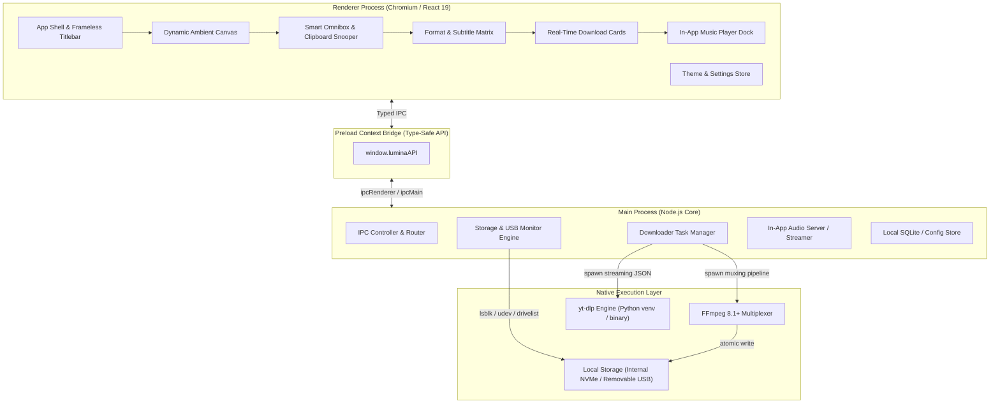

# Lumina Media Workstation — Tech Stack & System Architecture Specification

## 1. Architectural Stack Evaluation & Decision Matrix

To build an uncompromising, hardware-accelerated media workstation with a modern minimal glassmorphism UI for **Fedora 44 (Linux)** and seamless cross-platform targeting for **Windows 11/10** and **macOS**, we evaluated four desktop application architectures:

| Criterion | Electron + Vite + React 19 (Selected) | Tauri v2 (Rust + Webview) | Flutter Desktop (Dart + C++) | Python (PySide6 / CustomTkinter) |
| :--- | :--- | :--- | :--- | :--- |
| **UI/UX & Motion Capabilities** | **10/10** (Unmatched: WebGL canvas, Framer Motion, 120fps CSS backdrop-filter, Web Audio API) | **9/10** (Excellent web-based UI, but Linux webview can stutter on backdrop-filter blur) | **8/10** (Strong 2D canvas, but difficult to do complex layered glassmorphism) | **4/10** (Clunky, rigid styling, poor animation physics, feels like 2010s) |
| **Fedora 44 Compilation Readiness** | **10/10** (Pre-built runtime binary runs natively; zero C-header dependencies) | **2/10** (Requires `gtk3-devel` and `webkit2gtk4.1-devel`, blocked on non-root machines) | **2/10** (`flutter doctor` reports missing `gtk3-devel` headers) | **7/10** (Wheel installation works, but Qt wheels frequently have Wayland font issues) |
| **Cross-Platform Portability (Win/Mac)** | **10/10** (Battle-tested across millions of installations: VS Code, Slack, Discord, Spotify) | **9/10** (Solid, but Windows requires WebView2 runtime pre-installed) | **8/10** (Native Windows/macOS, requires platform C++ compilers) | **6/10** (PyInstaller/Nuitka bundling frequently causes false AV flags) |
| **Packaging & Distribution** | **10/10** (`electron-builder` generates native `.rpm`, `.AppImage`, `.deb`, `.exe`, `.msi`, `.dmg`) | **9/10** (Cargo tauri produces deb/rpm/msi) | **7/10** (Requires manual toolchains for RPM/MSI) | **5/10** (Fragile binary packaging) |
| **Media Extraction & Pipe Handling** | **10/10** (Node.js Streams + IPC handle multi-gigabyte files and live CLI outputs with ease) | **10/10** (Rust channels & Tokio are superb) | **6/10** (Process pipes in Dart are less ergonomic) | **9/10** (Native Python calls, but blocks GUI thread easily) |

### Selected Architecture: Electron (v44) + Vite + React 19 + TypeScript + Tailwind CSS + Node.js Engine
- **Why this is the winning choice**:
  1. **Instant Environment Compatibility**: Runs immediately on Fedora 44 with KDE Plasma 6 Wayland/X11 without requiring missing `gtk3-devel` or root permissions.
  2. **Unrivaled Design Capabilities**: Enables 100% custom styling, interactive canvas shaders, spring physics, dynamic lighting, and audio spectrum visualizers.
  3. **Multi-Platform Build Targets**: Produces native `.rpm` packages for Fedora, `.exe`/`.msi` for Windows, and `.dmg` for macOS from the exact same codebase.
  4. **Robust Process Management**: Node.js child-process architecture reliably streams `yt-dlp` output line-by-line, parses JSON telemetry, and coordinates FFmpeg muxing jobs without UI lockup.

---

## 2. High-Level Architecture Overview



---

## 3. Process Breakdown & Responsibilities

### 3.1 Main Process (`main/`)
1. **Window Lifecycle**: Frameless BrowserWindow with rounded corners, custom minimum sizing (960x640), and proper KDE/Windows window drag regions.
2. **Storage & USB Monitor**:
   - Polling & event-driven block device watcher (`lsblk -J` on Linux, Win32 drive queries on Windows, `diskutil` on macOS).
   - Automatically detects mount/unmount events of removable drives.
   - Creates directory structure (`/LuminaMedia/Videos` and `/LuminaMedia/Music`) on the newly attached drive.
3. **Downloader Task Manager**:
   - Spawns `yt-dlp` with `--newline --progress-template "%(progress._percent_str)s|%(progress._speed_str)s|%(progress._eta_str)s|%(progress.downloaded_bytes)s|%(progress.total_bytes)s"`.
   - Spawns `ffmpeg` for post-muxing separate high-res video and audio DASH streams into MP4 or MKV containers.
   - Manages queue concurrency (e.g., 2 simultaneous downloads, rest queued).
4. **Settings & Persistent Store**:
   - Uses `electron-store` or lightweight SQLite to store user preferences, active paths, and download history.

### 3.2 Preload Security Bridge (`preload/index.ts`)
Strict context isolation with a typed `LuminaAPI`:
```typescript
export interface LuminaAPI {
  // Media Inspection & Ingestion
  inspectUrl: (url: string) => Promise<MediaMetadata>;
  
  // Download Control
  startDownload: (request: DownloadRequest) => Promise<string>; // Returns task ID
  pauseDownload: (taskId: string) => Promise<boolean>;
  resumeDownload: (taskId: string) => Promise<boolean>;
  cancelDownload: (taskId: string) => Promise<boolean>;
  
  // Progress & Stream Events
  onDownloadProgress: (callback: (progress: DownloadProgress) => void) => () => void;
  onDownloadComplete: (callback: (payload: DownloadCompletePayload) => void) => () => void;
  
  // Storage & Hardware Detection
  getStorageDrives: () => Promise<StorageDrive[]>;
  onDriveConnected: (callback: (drive: StorageDrive) => void) => () => void;
  onDriveDisconnected: (callback: (driveId: string) => void) => () => void;
  
  // Audio Playback & Streaming
  searchMusic: (query: string) => Promise<MusicTrack[]>;
  getStreamUrl: (videoId: string) => Promise<string>;
  
  // Shell & System Actions
  openFile: (filePath: string) => Promise<void>;
  openDirectory: (filePath: string) => Promise<void>;
  getAppVersion: () => Promise<string>;
  getSystemInfo: () => Promise<SystemInfo>;
}
```

### 3.3 Renderer Process (`renderer/`)
- **State Management**: Zustand store providing synchronous reactive state for the download queue, active media playback, settings, and detected drives.
- **UI Stack**: React 19 + TypeScript + Tailwind CSS + Lucide Icons + Framer Motion.
- **Dynamic Background**: HTML5 2D Canvas ambient mesh running at 60fps with zero DOM overhead.
- **Audio Engine**: HTML5 Audio element feeding an `AudioContext` and `AnalyserNode` to drive the in-app waveform visualizer.

---

## 4. Multi-Platform Build & Packaging Pipeline

| Platform | Target Formats | Tooling | Distribution Channel |
| :--- | :--- | :--- | :--- |
| **Fedora 44 / RHEL** | `.rpm`, `.AppImage`, `.tar.gz` | `electron-builder` (`rpm` target) | Direct RPM download, COPR repository, Flathub |
| **Ubuntu / Debian** | `.deb`, `.AppImage` | `electron-builder` (`deb` target) | Direct DEB, Snap Store |
| **Windows 11/10** | `.exe` (NSIS Installer), `.msi`, Portable `.zip` | `electron-builder` (`nsis` target) | GitHub Releases, Microsoft Store |
| **macOS (Apple Silicon & Intel)** | Universal `.dmg`, `.zip` | `electron-builder` (`dmg` target) | Direct DMG download |
