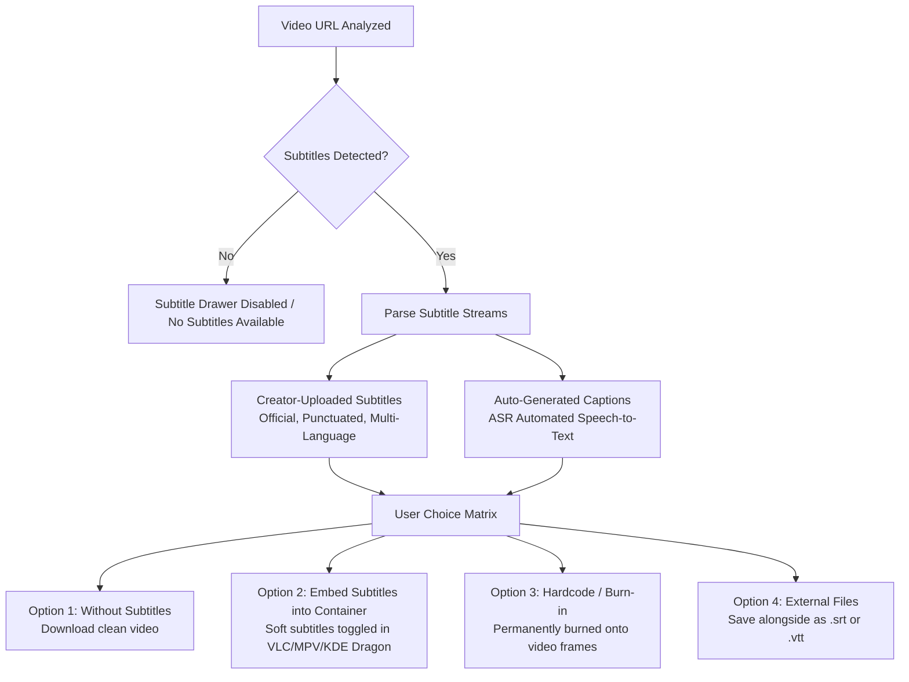

# Lumina Media Workstation — Core Downloader & Format Engine Specification

## 1. Universal Media Ingestion Scope
Lumina is engineered to accept and parse media links from any platform supported by the modern `yt-dlp` extraction core, with specialized UI handling for:
- **YouTube**: Standard videos, 60fps high-frame-rate videos, HDR (High Dynamic Range), 4K & 8K ultra-resolution streams, Shorts, Premieres, VODs, and complete Playlists/Channels.
- **Instagram**: Reels, Video Posts, Multi-slide Carousels, and Stories (via cookie authentication).
- **TikTok**: High-definition watermarked and unwatermarked video streams.
- **X (Twitter)**: Multi-bitrate video clips and animated GIFs.
- **SoundCloud / Bandcamp**: Pure high-bitrate audio streams and playlists.
- **Vimeo / Dailymotion / Twitch**: Broadcast VODs and clips.

---

## 2. Stream Resolution & Format Hierarchy: Unlocking 8K & 4K

### 2.1 The YouTube Format Architecture
YouTube separates video and audio on all streams above 720p using Dynamic Adaptive Streaming over HTTP (DASH). Standard web downloaders that only grab pre-muxed MP4s are capped at 720p or 360p. 

Lumina solves this by parsing YouTube's raw format matrix and orchestrating dual-stream retrieval:
1. **Best Video Stream**: Fetches the unthrottled raw video stream (up to 4320p / 8K, 60fps HDR, encoded in AV1 or VP9).
2. **Best Audio Stream**: Fetches the unthrottled raw audio stream (OPUS 160kbps or AAC 128kbps).
3. **Lossless FFmpeg Multiplexing**: Seamlessly merges both streams into a standard `.mp4` or `.mkv` container using `-c copy`, completing the mux in under 2 seconds without CPU transcoding or generational quality loss.

### 2.2 Format Selection Matrix

```
+-----------------------------------------------------------------------------------------------+
| RESOLUTION  | FRAME RATE | CODEC PREFERENCE | TYPICAL BITRATE | CONTAINER | PLAN LEVEL        |
+-------------+------------+------------------+-----------------+-----------+-------------------+
| 8K (4320p)  | 60fps HDR  | AV1 (av01)       | 35,000-50,000k  | MKV / MP4 | Max Quality       |
| 4K (2160p)  | 60fps HDR  | AV1 / VP9 (vp09) | 18,000-28,000k  | MKV / MP4 | Max Quality       |
| 2K (1440p)  | 60fps      | VP9 / AV1        | 8,000-14,000k   | MP4       | High Fidelity     |
| 1080p Pro   | 60fps      | AV1 / Enhanced   | 6,000-9,000k    | MP4       | Enhanced Bitrate  |
| 1080p Std   | 30/60fps   | H.264 (avc1)     | 3,500-5,000k    | MP4       | Universal Compat  |
| 720p HD     | 30/60fps   | H.264 / VP9      | 1,800-2,500k    | MP4       | Balanced          |
| 480p / 360p | 30fps      | H.264            | 600-1,000k      | MP4       | Data Saver        |
+-----------------------------------------------------------------------------------------------+
```

### 2.3 Audio Extraction Hierarchy
When the user selects **Audio Only**:
- **FLAC Lossless**: Preserves pristine frequency harmonics (transcoded via FFmpeg from the highest quality source stream).
- **MP3 (320 kbps CBR)**: Constant bitrate maximum quality MP3 for universal playback in older car stereos and media players.
- **OPUS (High-Res Native)**: Bit-for-bit extraction of YouTube's native OPUS audio stream without any re-encoding. (OPUS at 160kbps offers acoustic clarity equivalent or superior to 320kbps MP3).
- **AAC / M4A (256 kbps)**: Native Apple ecosystem container.
- **WAV (Uncompressed PCM)**: For direct editing in DAWs (Audacity, Reaper, FL Studio).

---

## 3. Subtitle Engine Specification

Lumina provides granular control over subtitles and closed captions:



### Technical Subtitle Extraction Flags:
- **Embed Subtitles**:
  `yt-dlp --write-subs --write-auto-subs --sub-langs "en,es,hi,fr" --embed-subs --merge-output-format mkv`
- **External Subtitles**:
  `yt-dlp --write-sub --sub-lang "en" --convert-subs srt -o "%(title)s.%(ext)s"`
- **Without Subtitles**:
  Default behavior (`--no-write-subs`).

---

## 4. Execution & Real-Time Telemetry Pipeline

To ensure the UI remains 100% fluid while downloading multi-gigabyte streams, the Node.js backend handles `yt-dlp` execution via an asynchronous spawned stream:

```typescript
// Example Node.js task launcher in main/downloader.ts
const args = [
  url,
  '--newline',
  '--progress-template',
  'LUMINA_PROGRESS:%(progress._percent_str)s|%(progress._speed_str)s|%(progress._eta_str)s|%(progress.downloaded_bytes)s|%(progress.total_bytes)s',
  '--format', formatSelectionString,
  '--ffmpeg-location', ffmpegPath,
  '-o', outputPathPattern
];

const proc = spawn(ytdlpPath, args);

proc.stdout.on('data', (chunk) => {
  const line = chunk.toString();
  if (line.includes('LUMINA_PROGRESS:')) {
    const [percent, speed, eta, downloaded, total] = parseTelemetry(line);
    mainWindow.webContents.send('download-progress', {
      taskId,
      percent: parseFloat(percent),
      speed,
      eta,
      downloadedBytes: parseInt(downloaded),
      totalBytes: parseInt(total)
    });
  }
});
```

---

## 5. Playlist & Batch Extraction Specification
When a playlist link is entered (e.g. `youtube.com/playlist?list=...`):
1. **Interactive Checklist**: Displays all videos with checkboxes, durations, and channels.
2. **Bulk Quality Selector**: "Apply 4K 60fps to all", "Apply 1080p to all", or "Convert entire playlist to 320kbps MP3".
3. **Concurrent Download Throttle**: Configurable concurrency pool (default: 2 active downloads, rest queued) to prevent network saturations and IP rate-limiting.
