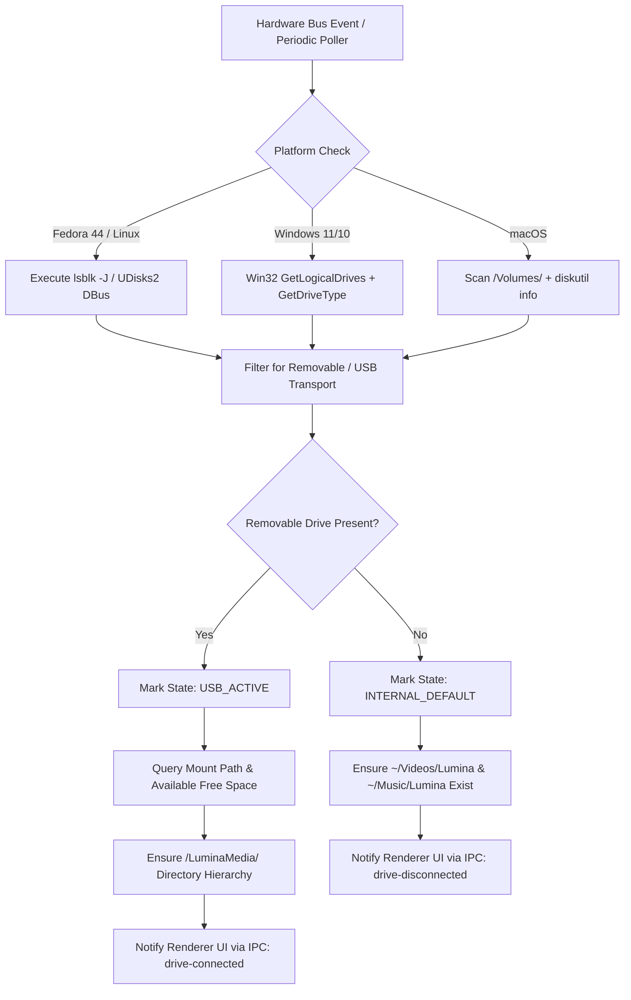

# Lumina Media Workstation — Storage Routing & USB Hardware Detection

## 1. Overview & Behavioral Contract
One of Lumina's premier automated capabilities is **Intelligent Removable Storage Auto-Routing**:
- **Automatic Pendrive / USB Detection**: The software continuously monitors hardware bus events across Fedora 44 (Linux), Windows, and macOS.
- **First-Time Folder Creation**: If a removable drive is attached, Lumina checks for a dedicated storage structure and automatically creates it if absent:
  - `<USB_ROOT>/LuminaMedia/Videos/`
  - `<USB_ROOT>/LuminaMedia/Music/`
  - `<USB_ROOT>/LuminaMedia/Playlists/`
- **Dynamic Routing Decision**:
  - If a USB drive is mounted $\rightarrow$ Media automatically routes to the USB drive.
  - If no USB drive is connected $\rightarrow$ Media automatically falls back to system storage (`~/Videos/Lumina` and `~/Music/Lumina`).
  - The user can always manually override this behavior in the quick-toggle bar or Settings.

---

## 2. Multi-Platform Hardware Detection Engine



### 2.1 Linux / Fedora 44 Implementation
On Fedora 44, removable USB drives are managed by `udisks2` and typically mounted under `/run/media/$USER/<LABEL>` or `/media/<LABEL>`.
Lumina inspects block devices using structured JSON from `lsblk`:
```bash
lsblk -J -o NAME,TYPE,SIZE,MOUNTPOINTS,RM,HOTPLUG,TRAN,MODEL,VENDOR,FSTYPE,LABEL
```
- **Identification Criteria**:
  - `tran == "usb"` OR `rm == true` OR `hotplug == true`
  - `mountpoints` contains at least one non-empty filesystem path
  - Excludes swap, loop devices, and internal NVMe (`nvme0n1`) partitions.

### 2.2 Windows 11/10 Implementation
On Windows, Lumina utilizes the native `node-disk-info` package or Win32 volume queries:
- Queries all drive letters (`D:`, `E:`, `F:`, etc.).
- Checks `GetDriveTypeW()`: flags matching `DRIVE_REMOVABLE` (2) are categorized as USB pendrives.
- Extracts volume label and cluster free-space metrics.

### 2.3 macOS Implementation
On macOS, Lumina scans `/Volumes/*` and checks mount properties via `diskutil info`, excluding `/` (Macintosh HD) and read-only DMGs.

---

## 3. Storage Hierarchy & Path Formatting

### 3.1 Directory Layout on USB Drives
```
[USB Pendrive Mount Root]
└── LuminaMedia/
    ├── Videos/
    │   ├── Starfield Official Gameplay Reveal [4K 60fps].mp4
    │   └── Starfield Official Gameplay Reveal [4K 60fps].en.srt
    ├── Music/
    │   ├── Daft Punk/
    │   │   └── Random Access Memories/
    │   │       └── Get Lucky [FLAC].flac
    └── Playlists/
        └── Chill Synthwave Archive/
```

### 3.2 Dynamic Path Naming Templates
Users can configure the file-naming template in Settings. Default formats:
- **Video Template**: `{title} [{resolution} {fps}fps].{ext}`
- **Audio Template**: `{artist} - {title} [{format}].{ext}`
- **Subtitles Template**: `{title}.{lang}.{ext}`

---

## 4. Performance Safeguard: NVMe Buffer & Atomic Transfer
> [!IMPORTANT]
> **Why Direct-to-USB Streaming is Dangerous**:
> Many USB flash drives have slow write speeds (10-25 MB/s) and random-access latency. Attempting to download a 60 MB/s network stream directly to a FAT32/exFAT pendrive while simultaneously muxing with FFmpeg can cause buffer underruns, download throttling, and filesystem corruption if the pendrive is bumped or disconnected.

### The Lumina Buffer Architecture:
1. **High-Speed Cache Download**: The media streams download and mux onto the local fast SSD cache (`~/.cache/lumina/staging/`).
2. **Atomic Verification**: Once FFmpeg validates the completed container and tags, the file is atomically copied to `<USB_MOUNT>/LuminaMedia/` using an optimized stream pipe.
3. **Live UI Status**: The queue card smoothly updates from `[MUXING]` to `[TRANSFERRING TO USB: SanDisk 64GB (75%)]`.
4. **Disconnection Safety**: If the USB drive is detached during the transfer, Lumina automatically prevents file loss by moving the file into the internal library (`~/Videos/Lumina/`) and prompting the user.
