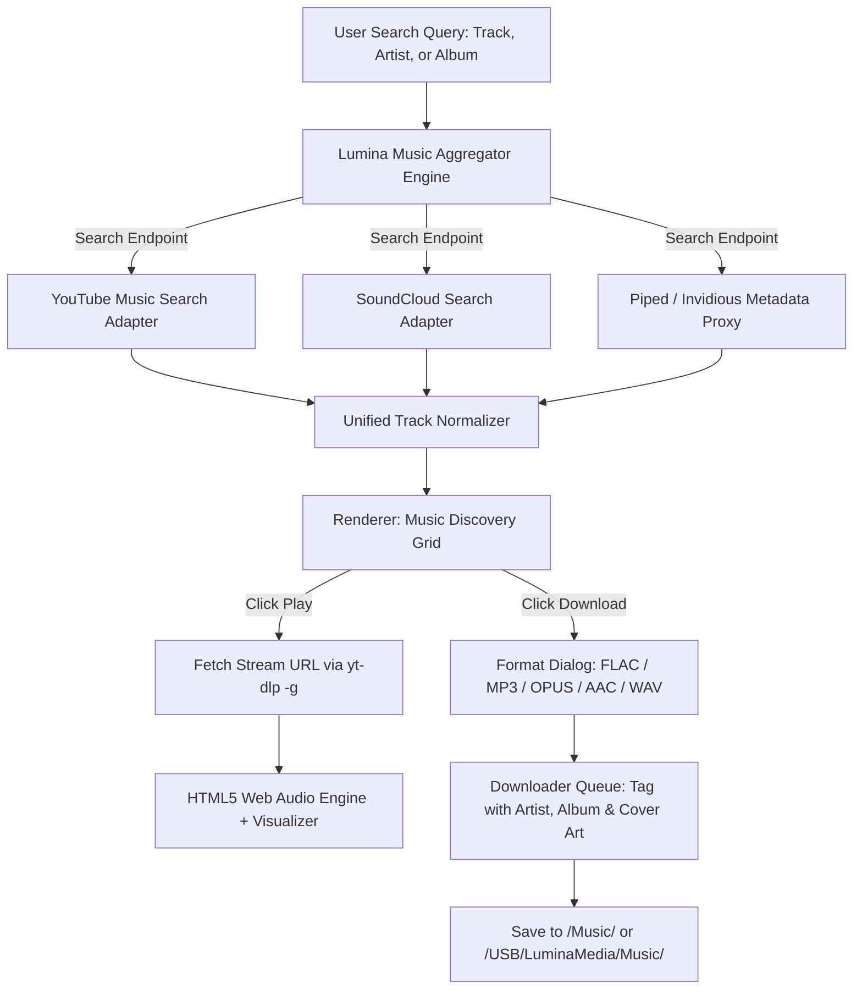

# Lumina Media Workstation — Music Discovery & In-App Player System

## 1. Vision & Functional Scope
Lumina is more than a downloader; it is an integrated **Music Workstation**:
- **Multi-Platform Music Discovery**: Seamlessly searches, discovers, and aggregates audio tracks from YouTube Music, SoundCloud, Invidious, and Bandcamp.
- **In-App Streaming & Playback**: Users can stream high-bitrate music directly inside Lumina without opening a browser or third-party client.
- **One-Click High-Fidelity Harvesting**: Any streamed or discovered track can be downloaded instantly in the user's preferred format (FLAC, MP3 320k, OPUS, AAC, WAV) with automatic album art and ID3 metadata embedding.
- **Offline Library Integration**: Built-in player plays downloaded songs from internal storage or attached USB drives with instant offline search.

---

## 2. Music Search & Fetching Architecture



### 2.1 Metadata Extraction Pipeline
When music is retrieved:
1. **High-Res Cover Artwork**: Extracted at 1000x1000 square resolution (stripping black letterbox bars).
2. **Standard ID3v2 / Vorbis Tags**:
   - `Title`, `Artist`, `Album`, `Year`, `Track Number`, `Genre`, `ISRC`.
3. **Lyrics Synchronization (LRC Support)**:
   - Queries synchronized lyrics for real-time karaoke display during in-app playback.

---

## 3. In-App Audio Player Architecture

### 3.1 Web Audio API Signal Chain
```
[HTML5 Audio Element] 
        |
        v
[createMediaElementSource(audioNode)] 
        |
        +---> [BiquadFilterNode (5-Band Equalizer)] ---> [GainNode (Volume)] ---> [audioContext.destination (Speakers)]
        |
        +---> [AnalyserNode (fftSize: 256)] ---> [Visualizer Canvas (Frequency Spectrum Waveform)]
```

### 3.2 Visualizer Modes
1. **Lumina Spectrum Waveform**: 64 vertical glass bars with cyan-to-violet gradient caps that bounce with rhythmic frequency amplitudes.
2. **Fluid Particle Horizon**: Ambient particle field where particles gently pulse outward from the album art in sync with bass drum hits.
3. **Minimal Clean Mode**: Flat sleek progress line for distraction-free work.

### 3.3 Player UI Controls
- **Transport**: Previous Track (`[⏮]`), Play/Pause (`[▶]`), Next Track (`[⏭]`), Shuffle (`[🔀]`), Loop Mode (`[🔁]` All / Single / Off).
- **Interactive Scrubber**: Millisecond-accurate scrubber with hover timestamp thumbnail preview.
- **Logarithmic Volume**: Volume slider with decibel-adjusted curve (`Math.pow(volume, 2)`) for natural human ear perception.
- **Docking Flexibility**:
  - **Docked Mode**: Fixed 72px sleek strip at the bottom of the dashboard.
  - **Full Theater Mode**: Expands to full screen with blurred album art backdrop and synchronized scrolling lyrics.

---

## 4. Format Conversion & Audio Tagging Engine

When downloading music, Lumina executes FFmpeg post-processing to ensure maximum quality and tag integrity:

```bash
# Example command for 320kbps MP3 with embedded high-res cover art and ID3v2.3 tags
yt-dlp \
  --extract-audio \
  --audio-format mp3 \
  --audio-quality 0 \
  --embed-thumbnail \
  --embed-metadata \
  --parse-metadata "%(artist)s:%(meta_artist)s" \
  --parse-metadata "%(title)s:%(meta_title)s" \
  --convert-thumbnails jpg \
  -o "~/Music/Lumina/%(artist)s/%(album)s/%(title)s.%(ext)s" \
  "<TRACK_URL>"
```

### Supported Output Audio Profiles:
- **FLAC**: Lossless compression, highest sonic fidelity.
- **MP3 (320 kbps)**: Maximum compatibility for car stereos, older MP3 players, and DJ equipment.
- **OPUS (160 kbps)**: Optimal compression; smaller file size with superior high-frequency preservation compared to MP3.
- **AAC (256 kbps)**: Ideal for iPhone, iPad, Apple Watch, and macOS native Music.app.
- **WAV**: Uncompressed PCM for direct import into audio workstations.
