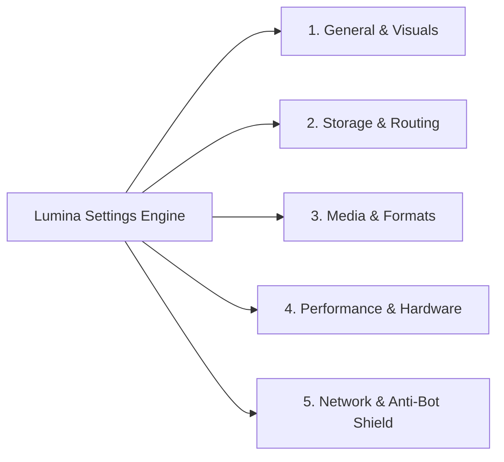
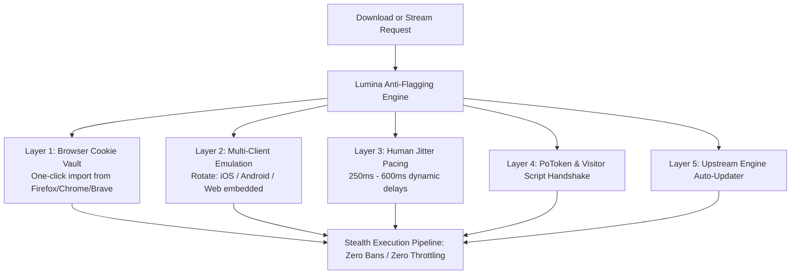

# Lumina Media Workstation — Settings, Network & Anti-Bot Shield Specification

## 1. Comprehensive Settings Architecture
Lumina provides complete, granular configuration across five dedicated settings panels:



### 1.1 Panel 1: General & Visual Preferences
- **Theme Selector**:
  - `Onyx Glow` (Default: deep obsidian black with cyan & violet luminescence).
  - `Cyber Velvet` (Dark plum with neon magenta & electric violet accents).
  - `Arctic Minimal` (Dark slate gray with frosted monochrome glass).
  - `Midnight Teal` (Deep ocean blue with glowing emerald accents).
- **Background Shader Intensity**:
  - `Dynamic WebGL Plasma` (Interactive 60fps ambient backdrop reacting to downloads and music).
  - `Eco-Saver CSS Gradient` (Static multi-stop gradient; minimal battery usage).
  - `Pure Dark Void` (Solid OLED black `#050507`).
- **Glassmorphism Blur**: Slider from `0px` (flat) to `32px` (deep frosted glass).
- **UI Font Scaling**: `90%`, `100%` (Default), `110%`, `125%`.
- **System Integration**:
  - `Minimize to System Tray` on window close.
  - `Launch on System Startup` (Minimized or Active).
  - `Desktop Notifications`: Sound chime and notification banner upon download completion.

### 1.2 Panel 2: Storage & Auto-Routing
- **Internal Video Path**: Default `~/Videos/Lumina/` (with folder browser dialog).
- **Internal Music Path**: Default `~/Music/Lumina/` (with folder browser dialog).
- **Removable Storage Auto-Route**:
  - Toggle: `[ON]` "Automatically detect connected USB pendrives and route downloads to them".
  - Pendrive Folder Name: Customizable (default `LuminaMedia`).
  - Safe Buffer Mode: `[ON]` "Download to high-speed SSD buffer first, then atomically move to USB" (prevents file corruption on slow flash drives).
- **File Naming Template**:
  - Default Video: `{title} [{resolution} {fps}fps].{ext}`
  - Default Music: `{artist} - {title} [{format}].{ext}`
  - Supported tokens: `{title}`, `{artist}`, `{album}`, `{resolution}`, `{fps}`, `{codec}`, `{uploader}`, `{id}`, `{date}`.

### 1.3 Panel 3: Media & Format Defaults
- **Default Video Resolution**: `Maximum Available (8K/4K)` / `1080p` / `720p` / `Ask Every Time`.
- **Preferred Video Codec**: `AV1 (Optimal compression)` / `VP9` / `H.264 (Broadest legacy playback)`.
- **Preferred Video Container**: `MP4` / `MKV`.
- **Default Audio Format**: `FLAC (Lossless)` / `MP3 (320 kbps)` / `OPUS (160 kbps Native)` / `AAC (256 kbps)`.
- **Subtitle Defaults**:
  - Toggle: `Include Subtitles by Default: [ON / OFF]`.
  - Preferred Languages: Multi-tag selector (`English [en]`, `Spanish [es]`, `Hindi [hi]`, `Japanese [ja]`).
  - Embedding Mode: `Embed into MKV/MP4 Container` / `Save as External .srt File`.

### 1.4 Panel 4: Performance & Hardware Acceleration
- **Concurrency Limit**: Slider from `1` to `8` simultaneous downloads (Default: `2` to avoid rate limits).
- **Global Bandwidth Throttle**: `Unlimited` or numeric cap in `MB/s` (e.g. `10 MB/s`).
- **FFmpeg Hardware Acceleration**:
  - `Auto-Detect` (Default).
  - Linux: `VAAPI` (`-hwaccel vaapi`) / Intel `QSV`.
  - Windows: Nvidia `NVENC` (`-hwaccel cuda`) / AMD `AMF` / Intel `QSV`.
  - macOS: Apple `VideoToolbox` (`-hwaccel videotoolbox`).

---

## 2. Anti-Bot, Anti-Flagging & Rate-Limit Shield

### 2.1 The Threat Model: How Platforms Flag Automated Harvesters
Streaming platforms (especially YouTube and Instagram) employ multi-vector bot detection:
1. **HTTP 429 Too Many Requests**: Triggered by rapid sequential requests from the same IP without human browsing latency.
2. **SABR (Streaming Adaptive Bitrate) Throttling**: YouTube throttles the transfer speed of raw video chunks to ~1.25x playback speed unless verified player tokens or mobile client profiles are present.
3. **PoToken (Proof of Origin) & Botguard**: YouTube challenges unauthenticated connections with cryptographic browser challenges.
4. **Age-Restricted & Private Media Gate**: Blocks all downloads without verified session cookies.

### 2.2 Lumina's Multi-Layer Defense Architecture



#### Layer 1: Secure Browser Cookie Vault
Lumina allows users to link their local browser session with one click without typing or exposing passwords:
- Native integration with `yt-dlp --cookies-from-browser firefox` (or `chrome`, `brave`, `edge`).
- Bypasses bot verification completely by piggybacking on legitimate, authenticated browser sessions.
- Enables downloading age-restricted videos, private playlists, and premium high-bitrate streams safely.

#### Layer 2: Multi-Client Emulation (`player_client`)
When fetching YouTube media, Lumina passes strategic client fallback arguments:
```bash
--extractor-args "youtube:player_client=ios,android,web"
```
Mobile app endpoints (iOS and Android) utilize different CDN routing and are significantly less prone to SABR speed throttling compared to generic desktop browser scrapers.

#### Layer 3: Human Jitter Pacing
When parsing large playlists or batch queues:
- Lumina enforces a randomized delay between metadata inspections ($350\text{ms} \pm 150\text{ms}$).
- Prevents immediate IP burst flagging from Cloudflare or YouTube edge nodes.

#### Layer 4: Self-Healing Engine Auto-Updater
YouTube changes obfuscation algorithms frequently:
- Lumina features an automated background check on app launch:
  `yt-dlp -U` or automated pip upgrade in the local project venv.
- If YouTube introduces a new cipher, Lumina updates its internal extractor within hours, without requiring the user to wait for a full application release!

#### Layer 5: Proxy & Privacy Gateway
Users operating on restrictive campus networks, corporate firewalls, or geo-blocked regions can route all extraction and download traffic through a custom proxy:
- Supported protocols: `SOCKS5`, `HTTP`, `HTTPS`.
- User authentication support (`user:password@proxy:port`).
