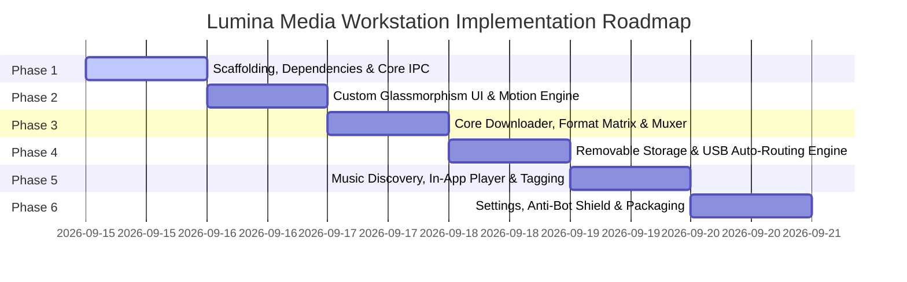

# Lumina Media Workstation — Systematic Execution Roadmap

## 1. Roadmap Overview & Phased Progression
This roadmap breaks down the construction of the Lumina Media Workstation into six distinct, sequentially verified phases:

---

## 2. Detailed Phase Breakdown

### Phase 1: Foundation & Project Scaffolding
- [ ] Initialize `package.json` with Electron v44, Vite, React 19, TypeScript, and Tailwind CSS.
- [ ] Establish directory structure:
  - `src/main/`: Electron main process (lifecycle, IPC controllers, storage watcher, process spawning).
  - `src/preload/`: Strictly typed `LuminaAPI` context bridge.
  - `src/renderer/`: React 19 frontend application.
  - `engine/`: Python virtual environment with `yt-dlp` and extractor helpers.
- [ ] Configure `vite.config.ts` and `electron-builder.json` targeting Linux (RPM / AppImage) and Windows (NSIS).
- [ ] Verify local execution: start Vite dev server and boot frameless Electron window.

### Phase 2: Custom Glassmorphic UI & Motion System
- [ ] Build the interactive dynamic ambient background canvas (60fps fluid mesh gradient).
- [ ] Implement the Splash Screen sequence:
  - SVG prism stroke-dashoffset morph animation.
  - System readiness verification (FFmpeg check, engine check).
  - Smooth window resize transition to main dashboard.
- [ ] Create the Custom Window Shell & Titlebar:
  - Frameless window controls (close, minimize, maximize).
  - Always-on-top pin toggle.
  - KDE Plasma & Windows compatible window dragging.
- [ ] Implement custom atomic components:
  - Magnetic spring buttons with glowing hover borders.
  - Glass card containers with frosted backdrop blur.
  - Segmented pill switches and animated sliders.

### Phase 3: Core Media Downloader & Format Matrix
- [ ] Implement the Smart Omnibox:
  - Automatic clipboard snooper with animated notification banner.
  - Instant URL analysis and metadata extraction.
- [ ] Build the Format & Quality Inspection Matrix:
  - Video stream chips: 8K (4320p), 4K (2160p), 1440p, 1080p60, 720p with codec badges (AV1, VP9, H.264).
  - Audio extraction chips: FLAC, MP3 320k, OPUS, AAC, WAV.
  - Subtitle drawer: with/without toggle, creator vs auto-generated, language selector, container embed vs external SRT.
- [ ] Implement the Child Process Download Runner in Node.js:
  - Spawning `yt-dlp` with structured telemetry parsing.
  - Handling dual-stream download (DASH video + audio) and lossless FFmpeg remuxing (`-c copy`).
- [ ] Build real-time Download Queue Cards:
  - Animated progress bar with glowing cyan head.
  - Transfer speed (MB/s), ETA, and completed byte counter.
  - Action buttons: Pause, Cancel, Open File, Open in Folder.

### Phase 4: Removable Storage (USB Pendrive) Auto-Routing
- [ ] Implement the Hardware Storage Poller in `src/main/storage.ts`:
  - Linux / Fedora 44: JSON parsing of `lsblk` block devices.
  - Windows: Drive letter scanning matching `DRIVE_REMOVABLE`.
- [ ] Implement directory initialization:
  - Automatically create `<USB_ROOT>/LuminaMedia/Videos` and `<USB_ROOT>/LuminaMedia/Music`.
- [ ] Build the Staging Buffer & Atomic Transfer Pipeline:
  - Download to high-speed NVMe SSD cache first.
  - Atomic transfer to USB upon mux completion.
- [ ] Build the UI Removable Drive Indicator:
  - Animated bottom-right slide-in banner when a pendrive is attached.
  - Status bar drive label and remaining free space gauge.

### Phase 5: Music Discovery & In-App Player Engine
- [ ] Implement the music search and metadata scraper.
- [ ] Build the in-app Web Audio API player:
  - AudioContext + AnalyserNode.
  - 64-band frequency spectrum waveform visualizer.
  - Scrubber, track metadata, volume slider with logarithmic scaling.
- [ ] Add one-click music harvesting:
  - High-res square cover art extraction.
  - Complete ID3v2 / Vorbis metadata tagging via FFmpeg.
- [ ] Build the Offline Music Library browser with instant search.

### Phase 6: Settings, Anti-Bot Shield & Packaging
- [ ] Implement the 5-panel Settings modal (General, Storage, Formats, Performance, Network).
- [ ] Integrate the Anti-Bot & Anti-Flagging Shield:
  - 1-click browser cookie importer (`firefox`, `chrome`, `brave`).
  - Mobile client emulation (`ios,android`).
  - Request jitter pacing.
  - Upstream `yt-dlp` engine auto-updater.
- [ ] Package verification:
  - Generate Linux RPM package for Fedora 44.
  - Generate AppImage and verify standalone execution.
  - Prepare Windows NSIS build configuration.
- [ ] Execute Git local commits under username `nikhlgoel`.
